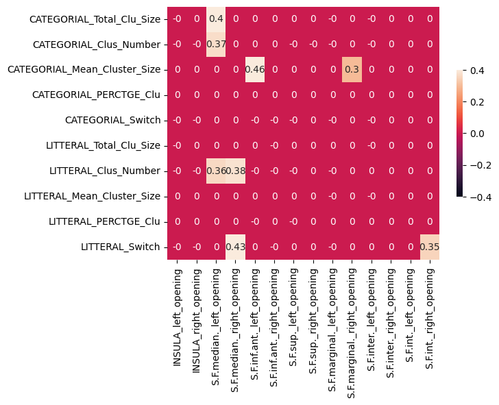
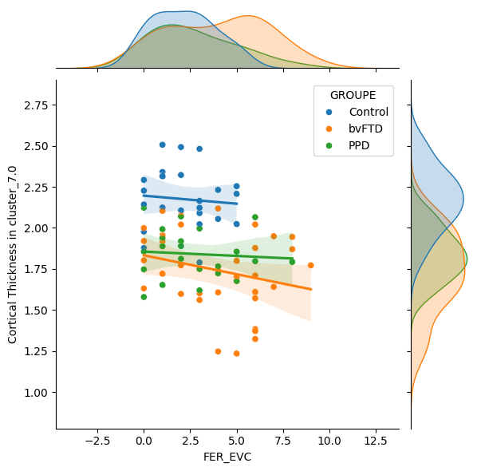
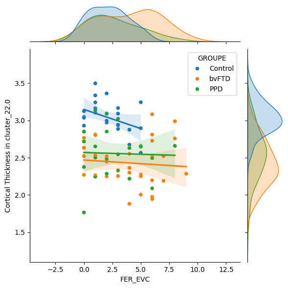
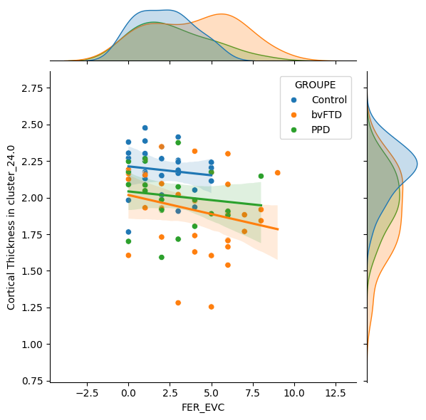
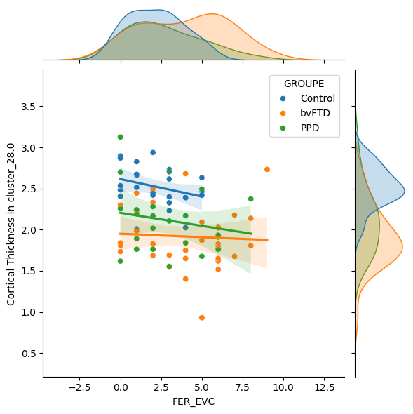
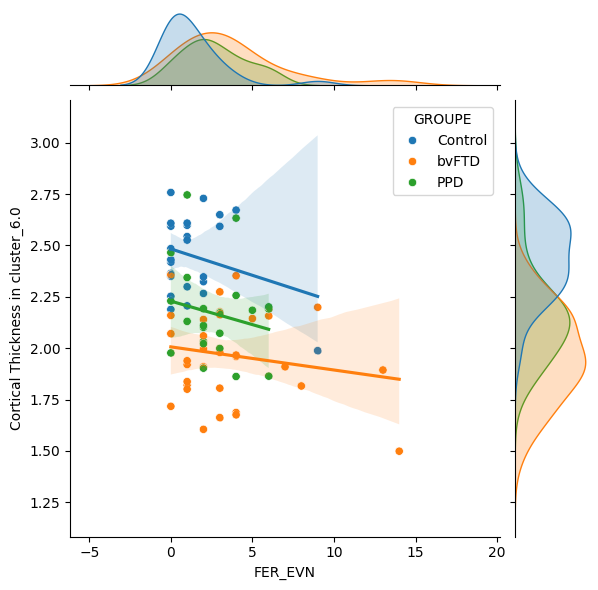

## TOC:
* [First Bullet Header](#first-bullet)
* [Second Bullet Header](#second-bullet)


```python
import os
import numpy as np
import nibabel as nib
import matplotlib.pyplot as plt
from brainspace.mesh.mesh_io import read_surface
from brainspace.plotting import plot_hemispheres
import pandas as pd
import seaborn as sns
from scipy.stats import ttest_ind
import statsmodels.api as sm
import glob
import plotly.graph_objects as go
from scipy.stats import chi2_contingency
import scipy.stats as stats
from sklearn.linear_model import LinearRegression
import laBIBILaRORO as lbr
from importlib import reload
#reload(laBIBILaRORO)
from itertools import combinations
#! pip install pingouin
import pingouin as pg
from scipy.stats import f_oneway
from scipy.stats import pearsonr
import re
from scipy.stats import zscore
%matplotlib inline

import numpy as np
from scipy.stats import pearsonr
from sklearn.linear_model import LinearRegression
from sklearn.metrics import explained_variance_score
```

# Déclaration et définition des variables


```python
#Chemin 
STUDY_PATH=os.path.join("/NAS","dumbo","protocoles","PSY_bvFTD")

DERIVATIVE_DIR1=os.path.join(STUDY_PATH,"data","bids","derivatives")
DERIVATIVE_DIR2=os.path.join("/NAS","deathrow","renaud","MRI_INSCD_maximeBertoux","bids","derivatives")

```


```python
#Lecture des deux fichiers Excel (variables clinique)
clinical_data = pd.read_excel(os.path.join(STUDY_PATH,"Imagerie_30052024.xlsx"))
clinical_data.set_index("ID_IRM", inplace=True)

#var=pd.read_excel(os.path.join(STUDY_PATH,'Imagerie_30052024.xlsx'),index_col="Nom")
#var=var.drop(columns=["DIAGNOSTIC"])
#var=var.drop(columns=["Date_IRM_Proche_BNP"])
#var=var.drop(columns=["DDN"])
etude1=clinical_data[clinical_data['ETUDE1_IRM']=='oui']
etude2=clinical_data[clinical_data['ETUDE2_IRM']=='oui']
print(len(clinical_data),len(etude1),len(etude2))
```

    146 126 47


```python
#prof = pd.read_excel(os.path.join(STUDY_PATH,'BDD_Imagerie_Etude_Neuropsy_ProfileJD.xlsx'),index_col="Nom")
```


```python
# Liste des patients
#liste_patients = list(set(list(etude1.index) + list(etude2.index))-set(prof.index))
#print(liste_patients)
# Récupération des champs "xx" et "bb" pour les patients de la liste
#df_patients = var.loc[var.index.isin(liste_patients), ['IDENTIFIANT','Prenom','DDN',"Dates_BNP_MINISEA_","Date_IRM_Proche_BNP","Dates_IRM","GROUPE"]]
#df_patients
```


```python
#Controls=var[var['GROUPE'] == 'Control']
#bvFTD=var[var['GROUPE'] == 'bvFTD']
#PPD=var[var['GROUPE'] == 'PPD']
```


```python
files = glob.glob(os.path.join(STUDY_PATH,"csv_sulcus2","sub-*.csv"))

df4col=pd.read_csv(os.path.join(STUDY_PATH,"csv_sulcus2","sub-PSY088_ses-1_acq-2013DT1TFE++3D_T1w_default_session_auto_sulcal_morphometry.csv"),sep=';')
colonnes=['subj'] #,'group','ss-group','age','education','sexe']
#colonnes=['ID_IRM','GROUPE','AGE','GENDER','SOUS_GROUPE']

for sillon in df4col['sulcus']:
    for col in df4col.columns[3:]:
        colonnes.append(sillon+"_"+col)

df_sulcus = pd.DataFrame(columns=colonnes)

for cpt,file in enumerate(files) :
    df_tmp=pd.read_csv(file,sep=';')        
    resultat = re.search(r'-(.*?)[\._]', file)
    subj = resultat.group(1)
    
    if subj in clinical_data.index:
        #diag=clinical_data.loc[subj].GROUPE
        #ssdiag=clinical_data.loc[subj].SOUS_GROUPE     
        #age=clinical_data.loc[subj].AGE
        #education=clinical_data.loc[subj].EDUCATION
        #sex=clinical_data.loc[subj].Gender_1M_0F
        
        #maliste=[subj,diag,ssdiag,age,education,sex]
        #print(cpt,maliste)
        df_sulcus.loc[cpt]=[subj]+list(df_tmp.iloc[:,3:].values.flatten())        # Use subject_data for further processing
    else:
        print(f"Subject {subj} not found in clinical data.") 

df_sulcus.set_index("subj", inplace=True)

```

    Subject c06p0028 not found in clinical data.
    Subject PSY053 not found in clinical data.
    Subject PSY004 not found in clinical data.
    Subject c06p0025 not found in clinical data.
    Subject PSY056 not found in clinical data.


# Analyses des sillons par BRAINVISA

Lecture du fichier la correspondance label  et acronyme de Brainvisa


```python

lut_names=pd.read_csv(os.path.join(STUDY_PATH,"anat_landmark_atlas.csv"),sep=',')  


#exemple Pour récuper un label à partir d'un acronyme
valeur_acronym = 'F.C.L.a._left'
colonne_label = lut_names.loc[lut_names['brainvisa_acronym'] == valeur_acronym, 'label']
print(valeur_acronym,colonne_label[0])

#exemple pour  l'inverse un acronyme à partir d'un label
valeur_label = 'Left anterior lateral fissure'
colonne_acronym = lut_names.loc[lut_names['label'] == valeur_label, 'brainvisa_acronym']
print(valeur_label,colonne_acronym[0])

#exemple 
lut_names.loc[lut_names['label'].str.contains("frontal"), ['brainvisa_acronym','label']]
```

    F.C.L.a._left Left anterior lateral fissure
    Left anterior lateral fissure F.C.L.a._left


<div>
<style scoped>
    .dataframe tbody tr th:only-of-type {
        vertical-align: middle;
    }

    .dataframe tbody tr th {
        vertical-align: top;
    }

    .dataframe thead th {
        text-align: right;
    }
</style>
<table border="1" class="dataframe">
  <thead>
    <tr style="text-align: right;">
      <th></th>
      <th>brainvisa_acronym</th>
      <th>label</th>
    </tr>
  </thead>
  <tbody>
    <tr>
      <th>48</th>
      <td>S.F.inf._left</td>
      <td>Left inferior frontal sulcus</td>
    </tr>
    <tr>
      <th>49</th>
      <td>S.F.inf._right</td>
      <td>Right inferior frontal sulcus</td>
    </tr>
    <tr>
      <th>50</th>
      <td>S.F.inf.ant._left</td>
      <td>Left anterior inferior frontal sulcus</td>
    </tr>
    <tr>
      <th>51</th>
      <td>S.F.inf.ant._right</td>
      <td>Right anterior inferior frontal sulcus</td>
    </tr>
    <tr>
      <th>52</th>
      <td>S.F.int._left</td>
      <td>Left internal frontal sulcus</td>
    </tr>
    <tr>
      <th>53</th>
      <td>S.F.int._right</td>
      <td>Right internal frontal sulcus</td>
    </tr>
    <tr>
      <th>54</th>
      <td>S.F.inter._left</td>
      <td>Left intermediate frontal sulcus</td>
    </tr>
    <tr>
      <th>55</th>
      <td>S.F.inter._right</td>
      <td>Right intermediate frontal sulcus</td>
    </tr>
    <tr>
      <th>56</th>
      <td>S.F.marginal._left</td>
      <td>Left marginal frontal sulcus</td>
    </tr>
    <tr>
      <th>57</th>
      <td>S.F.marginal._right</td>
      <td>Right marginal frontal sulcus</td>
    </tr>
    <tr>
      <th>58</th>
      <td>S.F.median._left</td>
      <td>Left median frontal sulcus</td>
    </tr>
    <tr>
      <th>59</th>
      <td>S.F.median._right</td>
      <td>Right median frontal sulcus</td>
    </tr>
    <tr>
      <th>60</th>
      <td>S.F.orbitaire._left</td>
      <td>Left orbital frontal sulcus</td>
    </tr>
    <tr>
      <th>61</th>
      <td>S.F.orbitaire._right</td>
      <td>Right orbital frontal sulcus</td>
    </tr>
    <tr>
      <th>62</th>
      <td>S.F.polaire.tr._left</td>
      <td>Left polar frontal sulcus</td>
    </tr>
    <tr>
      <th>63</th>
      <td>S.F.polaire.tr._right</td>
      <td>Right polar frontal sulcus</td>
    </tr>
    <tr>
      <th>64</th>
      <td>S.F.sup._left</td>
      <td>Left superior frontal sulcus</td>
    </tr>
    <tr>
      <th>65</th>
      <td>S.F.sup._right</td>
      <td>Right superior frontal sulcus</td>
    </tr>
  </tbody>
</table>
</div>


Liste de sillons et des paramètres  étudiés 


```python
sulcus_list=['INSULA','S.F.median.','S.F.inf.ant.','S.F.sup.','S.F.marginal.','S.F.inter.','S.F.int.']
bv_param_list=['opening']
col_list=[]
for sul in sulcus_list :
    for lat in ['left','right']:
        for par in bv_param_list :
            col_list.append(sul+'_'+lat+'_'+par)
print(col_list)
```

    ['INSULA_left_opening', 'INSULA_right_opening', 'S.F.median._left_opening', 'S.F.median._right_opening', 'S.F.inf.ant._left_opening', 'S.F.inf.ant._right_opening', 'S.F.sup._left_opening', 'S.F.sup._right_opening', 'S.F.marginal._left_opening', 'S.F.marginal._right_opening', 'S.F.inter._left_opening', 'S.F.inter._right_opening', 'S.F.int._left_opening', 'S.F.int._right_opening']


```python
#colonnes_fil = df.filter(regex='GM_thickness$', axis=1)
#colonnes_fil = df.filter(regex='opening$', axis=1)
#colonnes_fil = df.filter(regex='_', axis=1)
#df.filter(regex='^(F.C.M.|F.I.P.).*native$', axis=1).columns
#colonnes_fil = df.filter(regex='^(F.C.M.|F.I.P.)', axis=1)
#colonnes_fil = df[col_list]
#groupe_DFTc = df[df['group'] == 'DFTc'].loc[:][2:]
#groupe_TPP = df[df['group'] == 'TPP'].loc[:][2:]
```

## Première étude 


```python
df_etude1_scoreAndCov=clinical_data.where(clinical_data['ETUDE1_IRM'].dropna() == 'oui')
df_etude1_scoreAndCov_index=df_etude1_scoreAndCov.index.dropna()
df_etude1_sulcus = df_sulcus[df_sulcus.index.isin(df_etude1_scoreAndCov_index)]

var4Corr_scoresNeurpsy=['FER','mFP','mFP_SocialContext','mFP_Mentalizing','mFP_Controls','Praxies','Denomition','FCSRT_RL','FCSRT_RT','TOP10']
var4Corr_typeErreurs=['FER_EVC','FER_EVN','mFP_IDK','mFP_WrongC','mFP_WrongFP','mFP_Norm','mFP_Altertive','mFP_Irrelevant','mFP_Jugmental','mFP_Consequences','mFP_Malicious','mFP_Undermentalizing','mFP_Intentiol','mFP_WrongEmot','mFP_NoEmot']
var4Corr=var4Corr_scoresNeurpsy+var4Corr_typeErreurs
var4Cov=['AGE','EDUCATION']#,'Gender_1M_0F']
```


```python
var4CorrNormMinMax = [x+'NormMinMax' for x in var4Corr]
var4CorrNormZScore = [x+'NormZScore' for x in var4Corr]
var4CovNormMinMax = [x+'NormMinMax' for x in var4Cov]
var4CovNormZScore = [x+'NormZScore' for x in var4Cov]
lbr.MinMax_func(var4Corr+var4Cov,clinical_data)
lbr.ZScore_func(var4Corr+var4Cov,clinical_data)
```

### 1.Contrastes de groupes et sous-groupes


```python
pretty_list = '\n ° '.join(col_list)
print(f"\033[1;34m Sulculs list (n={len(col_list)}) :\n ° {pretty_list}\033[0m")  

for groupUsed in ['GROUPE','SOUS_GROUPE'] :
    print(f"\033[1;31m *****************************\n{groupUsed}\n***************************** \033[0m")
    # Obtenez toutes les valeurs uniques dans la colonne 'group'
    #unique_values = df_etude1[groupUsed].dropna().unique()
    
    lbr.test_covar_funcWithANOVA(var4Cov,df_etude1_scoreAndCov,groupUsed)
    
    # Obtenez tous les couples possibles des valeurs uniques dans la colonne 'group'
    pairs = list(combinations(df_etude1_scoreAndCov[groupUsed].dropna().unique(), 2))
    for pair in pairs: # Itérez sur tous les couples
        print(f"\033[1;31m**\n{pair}\n**\033[0m")
        
        ssdf = df_etude1_sulcus.loc[df_etude1_scoreAndCov[groupUsed].isin([pair[0],pair[1]])]
        print(ssdf.shape,ssdf[col_list].dropna(axis=0).shape,ssdf[col_list].dropna(axis=1).shape)
    
        #Ttest sur les covariables
        if (len(var4Cov)>0):
            lbr.test_covar_funcOnTwoGroups(var4Cov,df_etude1_scoreAndCov,groupUsed,pair[0],pair[1])
            
        #ssdf['group'] = ssdf['group'].apply(lambda x: 1 if x == 'Control' else 0)

        if (len(var4Cov)>0):
            lbr.regress_covar_func(col_list,var4Cov,ssdf,df_etude1_scoreAndCov.loc[df_etude1_scoreAndCov.index.isin(ssdf.index)])
            
        g1=ssdf.loc[df_etude1_scoreAndCov[groupUsed] == pair[0]][col_list] 
        g2=ssdf.loc[df_etude1_scoreAndCov[groupUsed] == pair[1]][col_list] 
        p_values = [ttest_ind(g1[col].values,g2[col].values,equal_var=False) for col in col_list]
        pvalue_list = [result.pvalue for result in p_values]
        b_fdr,p_fdr=sm.stats.fdrcorrection(pvalue_list,alpha=0.05,method='indep',is_sorted=False)
        p_val_corr_tri = sorted(zip(p_values, [elt.replace("NormZScore","") for elt in col_list],b_fdr))

        print(f"\033[1;32m {np.sum(b_fdr)} sillon(s) sur {ssdf[col_list].dropna(axis=1).shape[1]} significativement différents \033[0m")
        for elt in p_val_corr_tri :
            if elt[2]:
                colonne_label = lut_names.loc[lut_names['brainvisa_acronym'] == elt[1].split('_')[0]+"_"+elt[1].split('_')[1], 'label']
                print(f"{colonne_label.values[0]}, p_FDR_value = {round(elt[0].pvalue,4)}")
                
                #CQ/QC
                median = ssdf[elt[1]].median()
                q1 = ssdf[elt[1]].quantile(0.25)
                q3 = ssdf[elt[1]].quantile(0.75)
                iqr = q3 - q1
                borne_inf = median - 3 * iqr
                borne_sup = median + 3 * iqr
                #print(np.min(df[elt[1]]),np.max(df[elt[1]]),borne_inf,borne_sup)
                #df_filtre = ssdf[(ssdf[elt[1]] <= borne_inf) | (ssdf[elt[1]] >= borne_sup)]
                #if (len(df_filtre.index) > 0):
                #    print("              attention "+str(len(df_filtre.index)) + " exclus à +/- 3 IQR")
                
                if (p_val_corr_tri[0][1]==elt[1]):
                    plt.figure()
                    sns.stripplot(ssdf.join(df_etude1_scoreAndCov.loc[ssdf.index][groupUsed]),y=elt[1],x=groupUsed,size=3,color="red")
                    ax=sns.violinplot(ssdf.join(df_etude1_scoreAndCov.loc[ssdf.index][groupUsed]),y=elt[1],x=groupUsed,hue=groupUsed)#,palette="muted")
                    plt.title(colonne_label.values[0]+" $p_{fdr}$ = "+str(np.round(elt[0].pvalue,5)))
                    plt.ylabel(elt[1].split('_')[2]+" (mm)") 
                      
```

     Sulculs list (n=14) :
     ° INSULA_left_opening
     ° INSULA_right_opening
     ° S.F.median._left_opening
     ° S.F.median._right_opening
     ° S.F.inf.ant._left_opening
     ° S.F.inf.ant._right_opening
     ° S.F.sup._left_opening
     ° S.F.sup._right_opening
     ° S.F.marginal._left_opening
     ° S.F.marginal._right_opening
     ° S.F.inter._left_opening
     ° S.F.inter._right_opening
     ° S.F.int._left_opening
     ° S.F.int._right_opening
     *****************************
    GROUPE
    ***************************** 
     AGE 
             AGE                        
            size  mean   min   max   std
    GROUPE                              
    Control   42  57.9  25.0  81.0  15.4
    PPD       38  61.1  40.0  78.0   8.8
    bvFTD     46  65.9  48.0  83.0   8.4 
     ANOVA for AGE : 0.00476
     EDUCATION 
            EDUCATION                      
                 size  mean  min   max  std
    GROUPE                                 
    Control        42  13.8  5.0  20.0  2.7
    PPD            38  10.6  5.0  20.0  3.0
    bvFTD          46  11.5  7.0  20.0  3.5 
     ANOVA for EDUCATION : 3e-05
    **
    ('Control', 'bvFTD')
    **
    (66, 1230) (58, 14) (66, 11)
    T-test for AGE : p-value=0.00293
    T-test for EDUCATION : p-value=0.00116
     11 sillon(s) sur 11 significativement différents 
    Right insula, p_FDR_value = 0.0
    Left insula, p_FDR_value = 0.0
    Left median frontal sulcus, p_FDR_value = 0.0012
    Left intermediate frontal sulcus, p_FDR_value = 0.0
    Right superior frontal sulcus, p_FDR_value = 0.0
    Right intermediate frontal sulcus, p_FDR_value = 0.0
    Left superior frontal sulcus, p_FDR_value = 0.0
    Right marginal frontal sulcus, p_FDR_value = 0.0
    Right internal frontal sulcus, p_FDR_value = 0.0
    Left internal frontal sulcus, p_FDR_value = 0.0
    Left marginal frontal sulcus, p_FDR_value = 0.0001
    **
    ('Control', 'PPD')
    **
    (58, 1230) (50, 14) (58, 10)
    T-test for AGE : p-value=0.25697
    T-test for EDUCATION : p-value=0.0
     6 sillon(s) sur 10 significativement différents 
    Right insula, p_FDR_value = 0.0001
    Left insula, p_FDR_value = 0.0007
    Left intermediate frontal sulcus, p_FDR_value = 0.0004
    Right marginal frontal sulcus, p_FDR_value = 0.0026
    Right superior frontal sulcus, p_FDR_value = 0.0085
    Right intermediate frontal sulcus, p_FDR_value = 0.0128
    **
    ('bvFTD', 'PPD')
    **
    (62, 1230) (56, 14) (62, 11)
    T-test for AGE : p-value=0.01302
    T-test for EDUCATION : p-value=0.18899


    /home/romain/SVN/python/romain/laBIBILaRORO.py:197: SettingWithCopyWarning: 
    A value is trying to be set on a copy of a slice from a DataFrame
    
    See the caveats in the documentation: https://pandas.pydata.org/pandas-docs/stable/user_guide/indexing.html#returning-a-view-versus-a-copy
      theDFsulcus.loc[:,theSulcusList] = theDFsulcus[theSulcusList].apply(lambda x: unconfound(x, theDFvar[covar].values.reshape(-1,1), False))
    /home/romain/SVN/python/romain/laBIBILaRORO.py:197: SettingWithCopyWarning: 
    A value is trying to be set on a copy of a slice from a DataFrame
    
    See the caveats in the documentation: https://pandas.pydata.org/pandas-docs/stable/user_guide/indexing.html#returning-a-view-versus-a-copy
      theDFsulcus.loc[:,theSulcusList] = theDFsulcus[theSulcusList].apply(lambda x: unconfound(x, theDFvar[covar].values.reshape(-1,1), False))
    /home/romain/SVN/python/romain/laBIBILaRORO.py:197: SettingWithCopyWarning: 
    A value is trying to be set on a copy of a slice from a DataFrame
    
    See the caveats in the documentation: https://pandas.pydata.org/pandas-docs/stable/user_guide/indexing.html#returning-a-view-versus-a-copy
      theDFsulcus.loc[:,theSulcusList] = theDFsulcus[theSulcusList].apply(lambda x: unconfound(x, theDFvar[covar].values.reshape(-1,1), False))
    /home/romain/SVN/python/romain/laBIBILaRORO.py:197: SettingWithCopyWarning: 
    A value is trying to be set on a copy of a slice from a DataFrame
    
    See the caveats in the documentation: https://pandas.pydata.org/pandas-docs/stable/user_guide/indexing.html#returning-a-view-versus-a-copy
      theDFsulcus.loc[:,theSulcusList] = theDFsulcus[theSulcusList].apply(lambda x: unconfound(x, theDFvar[covar].values.reshape(-1,1), False))
    /home/romain/SVN/python/romain/laBIBILaRORO.py:197: SettingWithCopyWarning: 
    A value is trying to be set on a copy of a slice from a DataFrame
    
    See the caveats in the documentation: https://pandas.pydata.org/pandas-docs/stable/user_guide/indexing.html#returning-a-view-versus-a-copy
      theDFsulcus.loc[:,theSulcusList] = theDFsulcus[theSulcusList].apply(lambda x: unconfound(x, theDFvar[covar].values.reshape(-1,1), False))
    /home/romain/SVN/python/romain/laBIBILaRORO.py:197: SettingWithCopyWarning: 
    A value is trying to be set on a copy of a slice from a DataFrame
    
    See the caveats in the documentation: https://pandas.pydata.org/pandas-docs/stable/user_guide/indexing.html#returning-a-view-versus-a-copy
      theDFsulcus.loc[:,theSulcusList] = theDFsulcus[theSulcusList].apply(lambda x: unconfound(x, theDFvar[covar].values.reshape(-1,1), False))


     10 sillon(s) sur 11 significativement différents 
    Right insula, p_FDR_value = 0.0102
    Right median frontal sulcus, p_FDR_value = 0.0036
    Right marginal frontal sulcus, p_FDR_value = 0.0298
    Left marginal frontal sulcus, p_FDR_value = 0.0227
    Right internal frontal sulcus, p_FDR_value = 0.0085
    Left intermediate frontal sulcus, p_FDR_value = 0.0031
    Left internal frontal sulcus, p_FDR_value = 0.0022
    Right superior frontal sulcus, p_FDR_value = 0.0019
    Right intermediate frontal sulcus, p_FDR_value = 0.0012
    Left superior frontal sulcus, p_FDR_value = 0.0013
     *****************************
    SOUS_GROUPE
    ***************************** 
     AGE 
                 AGE                        
                size  mean   min   max   std
    SOUS_GROUPE                             
    ADS           19  58.6  40.0  78.0   9.3
    BPD           13  64.9  53.0  78.0   7.0
    Control       42  57.9  25.0  81.0  15.4
    bvFTD         46  65.9  48.0  83.0   8.4 
     ANOVA for AGE : 0.00527
     EDUCATION 
                EDUCATION                      
                     size  mean  min   max  std
    SOUS_GROUPE                                
    ADS                19  10.5  7.0  15.0  1.9
    BPD                13  11.6  7.0  20.0  4.0
    Control            42  13.8  5.0  20.0  2.7
    bvFTD              46  11.5  7.0  20.0  3.5 
     ANOVA for EDUCATION : 0.00046
    **
    ('Control', 'bvFTD')
    **
    (66, 1230) (58, 14) (66, 11)
    T-test for AGE : p-value=0.00293
    T-test for EDUCATION : p-value=0.00116
     11 sillon(s) sur 11 significativement différents 
    Right insula, p_FDR_value = 0.0
    Left insula, p_FDR_value = 0.0
    Left median frontal sulcus, p_FDR_value = 0.0012
    Left intermediate frontal sulcus, p_FDR_value = 0.0
    Right superior frontal sulcus, p_FDR_value = 0.0
    Right intermediate frontal sulcus, p_FDR_value = 0.0
    Left superior frontal sulcus, p_FDR_value = 0.0
    Right marginal frontal sulcus, p_FDR_value = 0.0
    Right internal frontal sulcus, p_FDR_value = 0.0
    Left internal frontal sulcus, p_FDR_value = 0.0
    Left marginal frontal sulcus, p_FDR_value = 0.0001
    **
    ('Control', 'BPD')
    **
    (40, 1230) (34, 14) (40, 11)
    T-test for AGE : p-value=0.11835
    T-test for EDUCATION : p-value=0.03216
     3 sillon(s) sur 11 significativement différents 
    Right insula, p_FDR_value = 0.002
    Left insula, p_FDR_value = 0.004
    Left intermediate frontal sulcus, p_FDR_value = 0.009


    /home/romain/SVN/python/romain/laBIBILaRORO.py:197: SettingWithCopyWarning: 
    A value is trying to be set on a copy of a slice from a DataFrame
    
    See the caveats in the documentation: https://pandas.pydata.org/pandas-docs/stable/user_guide/indexing.html#returning-a-view-versus-a-copy
      theDFsulcus.loc[:,theSulcusList] = theDFsulcus[theSulcusList].apply(lambda x: unconfound(x, theDFvar[covar].values.reshape(-1,1), False))
    /home/romain/SVN/python/romain/laBIBILaRORO.py:197: SettingWithCopyWarning: 
    A value is trying to be set on a copy of a slice from a DataFrame
    
    See the caveats in the documentation: https://pandas.pydata.org/pandas-docs/stable/user_guide/indexing.html#returning-a-view-versus-a-copy
      theDFsulcus.loc[:,theSulcusList] = theDFsulcus[theSulcusList].apply(lambda x: unconfound(x, theDFvar[covar].values.reshape(-1,1), False))
    /home/romain/SVN/python/romain/laBIBILaRORO.py:197: SettingWithCopyWarning: 
    A value is trying to be set on a copy of a slice from a DataFrame
    
    See the caveats in the documentation: https://pandas.pydata.org/pandas-docs/stable/user_guide/indexing.html#returning-a-view-versus-a-copy
      theDFsulcus.loc[:,theSulcusList] = theDFsulcus[theSulcusList].apply(lambda x: unconfound(x, theDFvar[covar].values.reshape(-1,1), False))
    /home/romain/SVN/python/romain/laBIBILaRORO.py:197: SettingWithCopyWarning: 
    A value is trying to be set on a copy of a slice from a DataFrame
    
    See the caveats in the documentation: https://pandas.pydata.org/pandas-docs/stable/user_guide/indexing.html#returning-a-view-versus-a-copy
      theDFsulcus.loc[:,theSulcusList] = theDFsulcus[theSulcusList].apply(lambda x: unconfound(x, theDFvar[covar].values.reshape(-1,1), False))
    /home/romain/SVN/python/romain/laBIBILaRORO.py:197: SettingWithCopyWarning: 
    A value is trying to be set on a copy of a slice from a DataFrame
    
    See the caveats in the documentation: https://pandas.pydata.org/pandas-docs/stable/user_guide/indexing.html#returning-a-view-versus-a-copy
      theDFsulcus.loc[:,theSulcusList] = theDFsulcus[theSulcusList].apply(lambda x: unconfound(x, theDFvar[covar].values.reshape(-1,1), False))
    /home/romain/SVN/python/romain/laBIBILaRORO.py:197: SettingWithCopyWarning: 
    A value is trying to be set on a copy of a slice from a DataFrame
    
    See the caveats in the documentation: https://pandas.pydata.org/pandas-docs/stable/user_guide/indexing.html#returning-a-view-versus-a-copy
      theDFsulcus.loc[:,theSulcusList] = theDFsulcus[theSulcusList].apply(lambda x: unconfound(x, theDFvar[covar].values.reshape(-1,1), False))


    **
    ('Control', 'ADS')
    **
    (44, 1230) (38, 14) (44, 10)
    T-test for AGE : p-value=0.85601
    T-test for EDUCATION : p-value=1e-05
     0 sillon(s) sur 10 significativement différents 
    **
    ('bvFTD', 'BPD')
    **
    (44, 1230) (40, 14) (44, 12)
    T-test for AGE : p-value=0.70508
    T-test for EDUCATION : p-value=0.9194
     0 sillon(s) sur 12 significativement différents 
    **
    ('bvFTD', 'ADS')
    **
    (48, 1230) (44, 14) (48, 11)
    T-test for AGE : p-value=0.00289
    T-test for EDUCATION : p-value=0.23336
     0 sillon(s) sur 11 significativement différents 
    **
    ('BPD', 'ADS')
    **
    (22, 1230) (20, 14) (22, 11)
    T-test for AGE : p-value=0.04595
    T-test for EDUCATION : p-value=0.29151
     0 sillon(s) sur 11 significativement différents 


    /home/romain/SVN/python/romain/laBIBILaRORO.py:197: SettingWithCopyWarning: 
    A value is trying to be set on a copy of a slice from a DataFrame
    
    See the caveats in the documentation: https://pandas.pydata.org/pandas-docs/stable/user_guide/indexing.html#returning-a-view-versus-a-copy
      theDFsulcus.loc[:,theSulcusList] = theDFsulcus[theSulcusList].apply(lambda x: unconfound(x, theDFvar[covar].values.reshape(-1,1), False))
    /home/romain/SVN/python/romain/laBIBILaRORO.py:197: SettingWithCopyWarning: 
    A value is trying to be set on a copy of a slice from a DataFrame
    
    See the caveats in the documentation: https://pandas.pydata.org/pandas-docs/stable/user_guide/indexing.html#returning-a-view-versus-a-copy
      theDFsulcus.loc[:,theSulcusList] = theDFsulcus[theSulcusList].apply(lambda x: unconfound(x, theDFvar[covar].values.reshape(-1,1), False))
    /home/romain/SVN/python/romain/laBIBILaRORO.py:197: SettingWithCopyWarning: 
    A value is trying to be set on a copy of a slice from a DataFrame
    
    See the caveats in the documentation: https://pandas.pydata.org/pandas-docs/stable/user_guide/indexing.html#returning-a-view-versus-a-copy
      theDFsulcus.loc[:,theSulcusList] = theDFsulcus[theSulcusList].apply(lambda x: unconfound(x, theDFvar[covar].values.reshape(-1,1), False))
    /home/romain/SVN/python/romain/laBIBILaRORO.py:197: SettingWithCopyWarning: 
    A value is trying to be set on a copy of a slice from a DataFrame
    
    See the caveats in the documentation: https://pandas.pydata.org/pandas-docs/stable/user_guide/indexing.html#returning-a-view-versus-a-copy
      theDFsulcus.loc[:,theSulcusList] = theDFsulcus[theSulcusList].apply(lambda x: unconfound(x, theDFvar[covar].values.reshape(-1,1), False))
    /home/romain/SVN/python/romain/laBIBILaRORO.py:197: SettingWithCopyWarning: 
    A value is trying to be set on a copy of a slice from a DataFrame
    
    See the caveats in the documentation: https://pandas.pydata.org/pandas-docs/stable/user_guide/indexing.html#returning-a-view-versus-a-copy
      theDFsulcus.loc[:,theSulcusList] = theDFsulcus[theSulcusList].apply(lambda x: unconfound(x, theDFvar[covar].values.reshape(-1,1), False))
    /home/romain/SVN/python/romain/laBIBILaRORO.py:197: SettingWithCopyWarning: 
    A value is trying to be set on a copy of a slice from a DataFrame
    
    See the caveats in the documentation: https://pandas.pydata.org/pandas-docs/stable/user_guide/indexing.html#returning-a-view-versus-a-copy
      theDFsulcus.loc[:,theSulcusList] = theDFsulcus[theSulcusList].apply(lambda x: unconfound(x, theDFvar[covar].values.reshape(-1,1), False))


    

    


    

    


    

    


    

    


```python
listpat=set(ssdf.index) & set(df_etude1_scoreAndCov.index.dropna())
len(listpat)
```


    22


### 2.Corrélations scores neuropsychologiques


```python
lbr.corr_sillons_var_func(col_list,var4Corr_scoresNeurpsy,ssdf,clinical_data)
```


    

    


### 3.Corrélations type d’erreurs 


```python
lbr.corr_sillons_var_func(col_list,var4Corr_typeErreurs,ssdf,clinical_data)
```


    

    


## Deuxième étude 


```python
df_etude2_scoreAndCov_index=clinical_data.where(clinical_data['ETUDE2_IRM']=='oui')['ETUDE2_IRM'].dropna().index.dropna()
df_etude2_scoreAndCov=clinical_data.loc[df_etude2_scoreAndCov_index]
df_etude2_sulcus = df_sulcus[df_sulcus.index.isin(df_etude2_scoreAndCov_index)]

var4Corr_scoresNeurpsy=['GREMOT_LS','GREMOT_LS_Pragmatique','GREMOT_FluVerbes','GREMOT_FluFruits','GREMOT_FluLettres','GREMOT_DenoObjets','GREMOT_DenoVerbes','GREMOT_DenoPersonnes','GREMOT_Discoursnarratif','GREMOT_CompSynt','GREMOT_VerifOP','GREMOT_VerifEP']
var4Corr_Frequence=['LS_Frequence','DN_Frequence']
var4Corr_Fluence=['CATEGORIAL_Total_Clu_Size','CATEGORIAL_Clus_Number','CATEGORIAL_Mean_Cluster_Size','CATEGORIAL_PERCTGE_Clu','CATEGORIAL_Switch','LITTERAL_Total_Clu_Size','LITTERAL_Clus_Number','LITTERAL_Mean_Cluster_Size','LITTERAL_PERCTGE_Clu','LITTERAL_Switch']
var4Corr=var4Corr_scoresNeurpsy+var4Corr_Frequence+var4Corr_Fluence
```

### 1.Corrélations scores neuropsychologiques


```python
lbr.corr_sillons_var_func(col_list,var4Corr_scoresNeurpsy,df_etude2_sulcus,df_etude2_scoreAndCov)
```


    

    


### 2.Corrélations fréquence vocale fondamentale


```python
lbr.corr_sillons_var_func(col_list,var4Corr_Frequence,df_etude2_sulcus,df_etude2_scoreAndCov)
```


    

    


```python
lbr.corr_sillons_var_func(col_list,var4Corr_Fluence,df_etude2_sulcus,df_etude2_scoreAndCov)
```


    

    


# Analyse de l'epaisseur corticale sur fsaverage5

## Première étude 


```python
df_etude1_scoreAndCov=clinical_data.where(clinical_data['ETUDE1_IRM'].dropna() == 'oui')
df_etude1_scoreAndCov = df_etude1_scoreAndCov.loc[df_etude1_scoreAndCov.index.dropna()]
#df_etude1_scoreAndCov_index=df_etude1_scoreAndCov.index.dropna()
```


```python
valCT=[]
for elt in df_etude1_scoreAndCov.index:
    sub=f"sub-{str(elt)}"
    if elt.startswith("PSY") :
        path_file_lh=os.path.join(DERIVATIVE_DIR1,"micapipe_v0.2.0",sub,"ses-1","maps",sub+"_ses-1_hemi-L_surf-fsaverage5_label-thickness_sm6.func.gii")
        path_file_rh=os.path.join(DERIVATIVE_DIR1,"micapipe_v0.2.0",sub,"ses-1","maps",sub+"_ses-1_hemi-R_surf-fsaverage5_label-thickness_sm6.func.gii")
    else :
        path_file_lh=os.path.join(DERIVATIVE_DIR2,"micapipe_v0.2.0",sub,"ses-1","maps",sub+"_ses-1_hemi-L_surf-fsaverage5_label-thickness_sm6.func.gii")
        path_file_rh=os.path.join(DERIVATIVE_DIR2,"micapipe_v0.2.0",sub,"ses-1","maps",sub+"_ses-1_hemi-R_surf-fsaverage5_label-thickness_sm6.func.gii")
    if os.path.exists(path_file_lh) and os.path.exists(path_file_rh):
        tmp_rh=nib.load(path_file_rh) 
        tmp_lh=nib.load(path_file_lh)
        volumeG1 = np.concatenate([tmp_lh.darrays[0].data,tmp_rh.darrays[0].data], axis=0)
        valCT.append(volumeG1)
    else :
        df_etude1_scoreAndCov.drop(elt,inplace=True)
        print(elt)
       
#df_etude1_CT = pd.DataFrame(zscore(np.array(valCT),axis=1), index=df_etude1_scoreAndCov.index)       
df_etude1_CT = pd.DataFrame(np.array(valCT), index=df_etude1_scoreAndCov.index)       
print(df_etude1_CT.shape,df_etude1_scoreAndCov.shape)
```

    c06p0001
    c06p0002
    c06p0003
    c06p0008
    PSY007
    PSY016
    PSY017
    PSY019
    PSY022
    PSY026
    PSY031
    PSY038
    PSY043
    PSY051
    PSY064
    PSY069
    PSY070
    PSY082
    PSY087
    PSY090
    PSY091
    PSY092
    PSY093
    PSY094
    PSY096
    PSY097
    PSY098
    PSY099
    PSY102
    PSY103
    PSY104
    PSY105
    PSY106
    PSY107
    PSY108
    PSY110
    SIL001
    (99, 20484) (99, 72)


```python
from brainstat.datasets import fetch_mask, fetch_template_surface,fetch_parcellation
from brainspace.mesh.mesh_io import read_surface
from brainstat.stats.SLM import SLM
from brainstat.stats.terms import FixedEffect

glasser = fetch_parcellation("fsaverage5", "glasser", 360)
pial_left, pial_right = fetch_template_surface("fsaverage5",layer="pial",join=False)
inflated_left, inflated_right = fetch_template_surface("fsaverage5",layer="inflated",join=False)
pial_combined = fetch_template_surface("fsaverage5", join=True)
pial_combined_fslr32k = fetch_template_surface("fslr32k", join=True)
pial_left_fslr32k, pial_right_fslr32k = fetch_template_surface("fslr32k", join=False)
inflated_left_fslr32k,inflated_right_fslr32k = fetch_template_surface("fslr32k",layer="inflated", join=False)
mask = fetch_mask("fsaverage5")
```


```python
# Plot the average thickness of the left and right hemispheres on the fsaverage5 surface    
for groupUsed in ['GROUPE','SOUS_GROUPE'] :
    for gp in df_etude1_scoreAndCov[groupUsed].dropna().unique():
        plot_hemispheres(pial_left, pial_right, np.mean(df_etude1_CT.loc[df_etude1_scoreAndCov[groupUsed] == gp].values, axis=0), color_bar=True, color_range=(1.75, 3.25),
                label_text=[gp], cmap="viridis", embed_nb=True, size=(1400, 200), zoom=1.45,
                nan_color=(0.7, 0.7, 0.7, 1), transparent_bg=False,cb__labelTextProperty={"fontSize": 12}, interactive=True)
```


```python
figure_title="hjhjkh"
plot_hemispheres(pial_left, pial_right, cp[0].T, color_bar=True, color_range=(0, 0.05),
        label_text=["Cluster p-values"], cmap="autumn_r", embed_nb=True, size=(1400, 200), 
        zoom=1.45, nan_color=(0.7, 0.7, 0.7, 1), cb__labelTextProperty={"fontSize": 12}, 
        interactive=False,transparent_bg=False,screenshot=False, offscreen=True,filename=figure_title)
```


    

    


### 1.Contrastes de groupes et sous-groupes


```python
for groupUsed in ['GROUPE','SOUS_GROUPE'] :
    print(f"\033[1;31m *****************************\n{groupUsed}\n***************************** \033[0m")  
    # Obtenez tous les couples possibles des valeurs uniques dans la colonne 'group'
    pairs = list(combinations(df_etude1_scoreAndCov[groupUsed].dropna().unique(), 2))
    for pair in pairs: # Itérez sur tous les couples
        print(f"\033[1;31m**\n{pair}\n**\033[0m")        
        ssdf_covar = df_etude1_scoreAndCov.loc[df_etude1_scoreAndCov[groupUsed].isin([pair[0],pair[1]])]
        ssdf_CT = df_etude1_CT.loc[df_etude1_scoreAndCov[groupUsed].isin([pair[0],pair[1]])]
        #print(ssdf.shape,ssdf[col_list].dropna(axis=0).shape,ssdf[col_list].dropna(axis=1).shape)
    
        term_group = FixedEffect(ssdf_covar[groupUsed])
        model_group = term_group
        model_group_age_educ=model_group
        
        for varc in var4Cov:
            model_group_age_educ = model_group_age_educ + FixedEffect(ssdf_covar[varc])
        print(model_group_age_educ)
                
        contrast_group = (ssdf_covar[groupUsed] == pair[0]).astype(int) - (ssdf_covar[groupUsed] == pair[1]).astype(int)
        print(contrast_group)
        
        slm_group = SLM(
            model_group_age_educ,
            contrast_group,
            surf=pial_combined,
            mask=mask,
            correction=["fdr", "rft"],
            two_tailed=True,
            cluster_threshold=0.05,
        )
        
        slm_group.fit(ssdf_CT.values)
        
        """lot_hemispheres(inflated_left,inflated_right, slm_group.t, color_bar=True, color_range=(-4, 4),
        label_text=["t-values"], cmap="viridis", embed_nb=True, size=(1400, 200), zoom=1.45,
        nan_color=(0.7, 0.7, 0.7, 1), transparent_bg=False,cb__labelTextProperty={"fontSize": 12}, interactive=False) """
        cp = [np.copy(slm_group.P["pval"]["C"])]
        [np.place(x, np.logical_or(x > 0.05, ~mask), np.nan) for x in cp]

        figure_title="CTSurface_groupscomparison_"+pair[0]+"_vs_"+pair[1]
        plot_hemispheres(pial_left, pial_right, cp[0].T, color_bar=True, color_range=(0, 0.05),
        label_text=["Cluster p-values"], cmap="autumn_r", embed_nb=True, size=(1400, 200), 
        zoom=1.45, nan_color=(0.7, 0.7, 0.7, 1), cb__labelTextProperty={"fontSize": 12}, 
        interactive=False,transparent_bg=False,screenshot=False, offscreen=True,filename=figure_title)

"""         plt.figure()
        plot_hemispheres(inflated_left,inflated_right,vals, color_bar=True, color_range=(0, 0.05),
        label_text=["Cluster p-values", "Peak p-values", "Vertex p-values"], cmap="autumn_r", 
        embed_nb=True, size=(1400, 400), zoom=1.8, nan_color=(0.7, 0.7, 0.7, 1), 
        cb__labelTextProperty={"fontSize": 12},transparent_bg=False, interactive=False)
        plt.show() """
```

     *****************************
    GROUPE
    ***************************** 
    **
    ('Control', 'bvFTD')
    **
        intercept  GROUPE_Control  GROUPE_bvFTD   AGE  EDUCATION
    0           1               1             0  58.0       15.0
    1           1               1             0  65.0       14.0
    2           1               1             0  62.0       11.0
    3           1               1             0  60.0       15.0
    4           1               1             0  55.0       14.0
    ..        ...             ...           ...   ...        ...
    58          1               0             1  74.0       17.0
    59          1               0             1  74.0       15.0
    60          1               1             0  44.0       14.0
    61          1               0             1  63.0        9.0
    62          1               0             1  61.0       10.0
    
    [63 rows x 5 columns]
    ID_IRM
    c06p0004    1
    c06p0005    1
    c06p0006    1
    c06p0007    1
    c06p0009    1
               ..
    PSY058     -1
    PSY059     -1
    PSY095      1
    PSY101     -1
    PSY009     -1
    Name: GROUPE, Length: 63, dtype: int64
    **
    ('Control', 'PPD')
    **
        intercept  GROUPE_Control  GROUPE_PPD   AGE  EDUCATION
    0           1               1           0  58.0       15.0
    1           1               1           0  65.0       14.0
    2           1               1           0  62.0       11.0
    3           1               1           0  60.0       15.0
    4           1               1           0  55.0       14.0
    5           1               1           0  65.0       12.0
    6           1               1           0  64.0       14.0
    7           1               1           0  69.0       15.0
    8           1               1           0  81.0       12.0
    9           1               1           0  75.0        9.0
    10          1               1           0  71.0       16.0
    11          1               1           0  70.0       14.0
    12          1               1           0  70.0       16.0
    13          1               1           0  70.0       11.0
    14          1               1           0  76.0       11.0
    15          1               1           0  74.0       13.0
    16          1               1           0  74.0        8.0
    17          1               1           0  74.0       14.0
    18          1               1           0  73.0       16.0
    19          1               1           0  76.0       16.0
    20          1               1           0  75.0        5.0
    21          1               1           0  58.0       11.0
    22          1               1           0  46.0       16.0
    23          1               1           0  56.0       15.0
    24          1               1           0  62.0       11.0
    25          1               0           1  60.0       17.0
    26          1               0           1  53.0       12.0
    27          1               0           1  61.0        7.0
    28          1               0           1  64.0       10.0
    29          1               0           1  62.0       10.0
    30          1               0           1  63.0       15.0
    31          1               0           1  54.0        9.0
    32          1               0           1  57.0       10.0
    33          1               0           1  61.0       11.0
    34          1               0           1  69.0        8.0
    35          1               0           1  49.0        9.0
    36          1               0           1  50.0       10.0
    37          1               0           1  40.0       15.0
    38          1               0           1  71.0       10.0
    39          1               0           1  63.0        9.0
    40          1               0           1  56.0       10.0
    41          1               0           1  66.0        8.0
    42          1               0           1  51.0       10.0
    43          1               0           1  65.0        8.0
    44          1               0           1  78.0       11.0
    45          1               0           1  58.0       10.0
    46          1               0           1  70.0       20.0
    47          1               0           1  49.0       11.0
    48          1               1           0  44.0       14.0
    49          1               0           1  66.0        7.0
    ID_IRM
    c06p0004    1
    c06p0005    1
    c06p0006    1
    c06p0007    1
    c06p0009    1
    c06p0010    1
    c06p0011    1
    c06p0012    1
    c06p0013    1
    c06p0014    1
    c06p0015    1
    c06p0016    1
    c06p0017    1
    c06p0018    1
    c06p0019    1
    c06p0020    1
    c06p0021    1
    c06p0022    1
    c06p0023    1
    c06p0024    1
    c06p0025    1
    c06p0026    1
    c06p0027    1
    c06p0029    1
    c06p0030    1
    PSY060     -1
    PSY061     -1
    PSY062     -1
    PSY063     -1
    PSY065     -1
    PSY066     -1
    PSY071     -1
    PSY072     -1
    PSY073     -1
    PSY074     -1
    PSY075     -1
    PSY076     -1
    PSY077     -1
    PSY078     -1
    PSY079     -1
    PSY080     -1
    PSY081     -1
    PSY083     -1
    PSY084     -1
    PSY085     -1
    PSY086     -1
    PSY088     -1
    PSY089     -1
    PSY095      1
    PSY109     -1
    Name: GROUPE, dtype: int64
    **
    ('bvFTD', 'PPD')
    **
        intercept  GROUPE_PPD  GROUPE_bvFTD   AGE  EDUCATION
    0           1           0             1  59.0       10.0
    1           1           0             1  68.0        7.0
    2           1           0             1  74.0        7.0
    3           1           0             1  53.0       17.0
    4           1           0             1  63.0       11.0
    ..        ...         ...           ...   ...        ...
    56          1           1             0  70.0       20.0
    57          1           1             0  49.0       11.0
    58          1           0             1  63.0        9.0
    59          1           1             0  66.0        7.0
    60          1           0             1  61.0       10.0
    
    [61 rows x 5 columns]
    ID_IRM
    PSY001    1
    PSY002    1
    PSY003    1
    PSY005    1
    PSY006    1
             ..
    PSY088   -1
    PSY089   -1
    PSY101    1
    PSY109   -1
    PSY009    1
    Name: GROUPE, Length: 61, dtype: int64
     *****************************
    SOUS_GROUPE
    ***************************** 
    **
    ('Control', 'bvFTD')
    **
        intercept  SOUS_GROUPE_Control  SOUS_GROUPE_bvFTD   AGE  EDUCATION
    0           1                    1                  0  58.0       15.0
    1           1                    1                  0  65.0       14.0
    2           1                    1                  0  62.0       11.0
    3           1                    1                  0  60.0       15.0
    4           1                    1                  0  55.0       14.0
    ..        ...                  ...                ...   ...        ...
    58          1                    0                  1  74.0       17.0
    59          1                    0                  1  74.0       15.0
    60          1                    1                  0  44.0       14.0
    61          1                    0                  1  63.0        9.0
    62          1                    0                  1  61.0       10.0
    
    [63 rows x 5 columns]
    ID_IRM
    c06p0004    1
    c06p0005    1
    c06p0006    1
    c06p0007    1
    c06p0009    1
               ..
    PSY058     -1
    PSY059     -1
    PSY095      1
    PSY101     -1
    PSY009     -1
    Name: SOUS_GROUPE, Length: 63, dtype: int64
    **
    ('Control', 'BPD')
    **
        intercept  SOUS_GROUPE_BPD  SOUS_GROUPE_Control   AGE  EDUCATION
    0           1                0                    1  58.0       15.0
    1           1                0                    1  65.0       14.0
    2           1                0                    1  62.0       11.0
    3           1                0                    1  60.0       15.0
    4           1                0                    1  55.0       14.0
    5           1                0                    1  65.0       12.0
    6           1                0                    1  64.0       14.0
    7           1                0                    1  69.0       15.0
    8           1                0                    1  81.0       12.0
    9           1                0                    1  75.0        9.0
    10          1                0                    1  71.0       16.0
    11          1                0                    1  70.0       14.0
    12          1                0                    1  70.0       16.0
    13          1                0                    1  70.0       11.0
    14          1                0                    1  76.0       11.0
    15          1                0                    1  74.0       13.0
    16          1                0                    1  74.0        8.0
    17          1                0                    1  74.0       14.0
    18          1                0                    1  73.0       16.0
    19          1                0                    1  76.0       16.0
    20          1                0                    1  75.0        5.0
    21          1                0                    1  58.0       11.0
    22          1                0                    1  46.0       16.0
    23          1                0                    1  56.0       15.0
    24          1                0                    1  62.0       11.0
    25          1                1                    0  60.0       17.0
    26          1                1                    0  64.0       10.0
    27          1                1                    0  62.0       10.0
    28          1                1                    0  63.0       15.0
    29          1                1                    0  69.0        8.0
    30          1                1                    0  71.0       10.0
    31          1                1                    0  65.0        8.0
    32          1                1                    0  58.0       10.0
    33          1                1                    0  70.0       20.0
    34          1                0                    1  44.0       14.0
    ID_IRM
    c06p0004    1
    c06p0005    1
    c06p0006    1
    c06p0007    1
    c06p0009    1
    c06p0010    1
    c06p0011    1
    c06p0012    1
    c06p0013    1
    c06p0014    1
    c06p0015    1
    c06p0016    1
    c06p0017    1
    c06p0018    1
    c06p0019    1
    c06p0020    1
    c06p0021    1
    c06p0022    1
    c06p0023    1
    c06p0024    1
    c06p0025    1
    c06p0026    1
    c06p0027    1
    c06p0029    1
    c06p0030    1
    PSY060     -1
    PSY063     -1
    PSY065     -1
    PSY066     -1
    PSY074     -1
    PSY078     -1
    PSY084     -1
    PSY086     -1
    PSY088     -1
    PSY095      1
    Name: SOUS_GROUPE, dtype: int64
    **
    ('Control', 'ADS')
    **
        intercept  SOUS_GROUPE_ADS  SOUS_GROUPE_Control   AGE  EDUCATION
    0           1                0                    1  58.0       15.0
    1           1                0                    1  65.0       14.0
    2           1                0                    1  62.0       11.0
    3           1                0                    1  60.0       15.0
    4           1                0                    1  55.0       14.0
    5           1                0                    1  65.0       12.0
    6           1                0                    1  64.0       14.0
    7           1                0                    1  69.0       15.0
    8           1                0                    1  81.0       12.0
    9           1                0                    1  75.0        9.0
    10          1                0                    1  71.0       16.0
    11          1                0                    1  70.0       14.0
    12          1                0                    1  70.0       16.0
    13          1                0                    1  70.0       11.0
    14          1                0                    1  76.0       11.0
    15          1                0                    1  74.0       13.0
    16          1                0                    1  74.0        8.0
    17          1                0                    1  74.0       14.0
    18          1                0                    1  73.0       16.0
    19          1                0                    1  76.0       16.0
    20          1                0                    1  75.0        5.0
    21          1                0                    1  58.0       11.0
    22          1                0                    1  46.0       16.0
    23          1                0                    1  56.0       15.0
    24          1                0                    1  62.0       11.0
    25          1                1                    0  53.0       12.0
    26          1                1                    0  61.0       11.0
    27          1                1                    0  49.0        9.0
    28          1                1                    0  50.0       10.0
    29          1                1                    0  40.0       15.0
    30          1                1                    0  63.0        9.0
    31          1                1                    0  56.0       10.0
    32          1                1                    0  66.0        8.0
    33          1                1                    0  78.0       11.0
    34          1                1                    0  49.0       11.0
    35          1                0                    1  44.0       14.0
    36          1                1                    0  66.0        7.0
    ID_IRM
    c06p0004    1
    c06p0005    1
    c06p0006    1
    c06p0007    1
    c06p0009    1
    c06p0010    1
    c06p0011    1
    c06p0012    1
    c06p0013    1
    c06p0014    1
    c06p0015    1
    c06p0016    1
    c06p0017    1
    c06p0018    1
    c06p0019    1
    c06p0020    1
    c06p0021    1
    c06p0022    1
    c06p0023    1
    c06p0024    1
    c06p0025    1
    c06p0026    1
    c06p0027    1
    c06p0029    1
    c06p0030    1
    PSY061     -1
    PSY073     -1
    PSY075     -1
    PSY076     -1
    PSY077     -1
    PSY079     -1
    PSY080     -1
    PSY081     -1
    PSY085     -1
    PSY089     -1
    PSY095      1
    PSY109     -1
    Name: SOUS_GROUPE, dtype: int64
    **
    ('bvFTD', 'BPD')
    **
        intercept  SOUS_GROUPE_BPD  SOUS_GROUPE_bvFTD   AGE  EDUCATION
    0           1                0                  1  59.0       10.0
    1           1                0                  1  68.0        7.0
    2           1                0                  1  74.0        7.0
    3           1                0                  1  53.0       17.0
    4           1                0                  1  63.0       11.0
    5           1                0                  1  81.0       15.0
    6           1                0                  1  68.0       20.0
    7           1                0                  1  53.0       10.0
    8           1                0                  1  82.0       17.0
    9           1                0                  1  71.0        9.0
    10          1                0                  1  55.0       12.0
    11          1                0                  1  72.0       12.0
    12          1                0                  1  71.0        7.0
    13          1                0                  1  67.0       10.0
    14          1                0                  1  71.0        8.0
    15          1                0                  1  61.0       10.0
    16          1                0                  1  57.0       10.0
    17          1                0                  1  66.0        9.0
    18          1                0                  1  48.0       12.0
    19          1                0                  1  70.0        8.0
    20          1                0                  1  73.0        8.0
    21          1                0                  1  71.0        9.0
    22          1                0                  1  61.0       11.0
    23          1                0                  1  74.0       15.0
    24          1                0                  1  62.0       11.0
    25          1                0                  1  64.0       17.0
    26          1                0                  1  64.0       10.0
    27          1                0                  1  71.0       14.0
    28          1                0                  1  71.0       15.0
    29          1                0                  1  71.0       17.0
    30          1                0                  1  61.0       12.0
    31          1                0                  1  66.0       20.0
    32          1                0                  1  72.0        8.0
    33          1                0                  1  74.0       17.0
    34          1                0                  1  74.0       15.0
    35          1                1                  0  60.0       17.0
    36          1                1                  0  64.0       10.0
    37          1                1                  0  62.0       10.0
    38          1                1                  0  63.0       15.0
    39          1                1                  0  69.0        8.0
    40          1                1                  0  71.0       10.0
    41          1                1                  0  65.0        8.0
    42          1                1                  0  58.0       10.0
    43          1                1                  0  70.0       20.0
    44          1                0                  1  63.0        9.0
    45          1                0                  1  61.0       10.0
    ID_IRM
    PSY001    1
    PSY002    1
    PSY003    1
    PSY005    1
    PSY006    1
    PSY008    1
    PSY010    1
    PSY011    1
    PSY012    1
    PSY014    1
    PSY018    1
    PSY021    1
    PSY023    1
    PSY024    1
    PSY025    1
    PSY027    1
    PSY028    1
    PSY032    1
    PSY036    1
    PSY037    1
    PSY039    1
    PSY041    1
    PSY042    1
    PSY045    1
    PSY046    1
    PSY047    1
    PSY048    1
    PSY049    1
    PSY050    1
    PSY052    1
    PSY054    1
    PSY055    1
    PSY057    1
    PSY058    1
    PSY059    1
    PSY060   -1
    PSY063   -1
    PSY065   -1
    PSY066   -1
    PSY074   -1
    PSY078   -1
    PSY084   -1
    PSY086   -1
    PSY088   -1
    PSY101    1
    PSY009    1
    Name: SOUS_GROUPE, dtype: int64
    **
    ('bvFTD', 'ADS')
    **
        intercept  SOUS_GROUPE_ADS  SOUS_GROUPE_bvFTD   AGE  EDUCATION
    0           1                0                  1  59.0       10.0
    1           1                0                  1  68.0        7.0
    2           1                0                  1  74.0        7.0
    3           1                0                  1  53.0       17.0
    4           1                0                  1  63.0       11.0
    5           1                0                  1  81.0       15.0
    6           1                0                  1  68.0       20.0
    7           1                0                  1  53.0       10.0
    8           1                0                  1  82.0       17.0
    9           1                0                  1  71.0        9.0
    10          1                0                  1  55.0       12.0
    11          1                0                  1  72.0       12.0
    12          1                0                  1  71.0        7.0
    13          1                0                  1  67.0       10.0
    14          1                0                  1  71.0        8.0
    15          1                0                  1  61.0       10.0
    16          1                0                  1  57.0       10.0
    17          1                0                  1  66.0        9.0
    18          1                0                  1  48.0       12.0
    19          1                0                  1  70.0        8.0
    20          1                0                  1  73.0        8.0
    21          1                0                  1  71.0        9.0
    22          1                0                  1  61.0       11.0
    23          1                0                  1  74.0       15.0
    24          1                0                  1  62.0       11.0
    25          1                0                  1  64.0       17.0
    26          1                0                  1  64.0       10.0
    27          1                0                  1  71.0       14.0
    28          1                0                  1  71.0       15.0
    29          1                0                  1  71.0       17.0
    30          1                0                  1  61.0       12.0
    31          1                0                  1  66.0       20.0
    32          1                0                  1  72.0        8.0
    33          1                0                  1  74.0       17.0
    34          1                0                  1  74.0       15.0
    35          1                1                  0  53.0       12.0
    36          1                1                  0  61.0       11.0
    37          1                1                  0  49.0        9.0
    38          1                1                  0  50.0       10.0
    39          1                1                  0  40.0       15.0
    40          1                1                  0  63.0        9.0
    41          1                1                  0  56.0       10.0
    42          1                1                  0  66.0        8.0
    43          1                1                  0  78.0       11.0
    44          1                1                  0  49.0       11.0
    45          1                0                  1  63.0        9.0
    46          1                1                  0  66.0        7.0
    47          1                0                  1  61.0       10.0
    ID_IRM
    PSY001    1
    PSY002    1
    PSY003    1
    PSY005    1
    PSY006    1
    PSY008    1
    PSY010    1
    PSY011    1
    PSY012    1
    PSY014    1
    PSY018    1
    PSY021    1
    PSY023    1
    PSY024    1
    PSY025    1
    PSY027    1
    PSY028    1
    PSY032    1
    PSY036    1
    PSY037    1
    PSY039    1
    PSY041    1
    PSY042    1
    PSY045    1
    PSY046    1
    PSY047    1
    PSY048    1
    PSY049    1
    PSY050    1
    PSY052    1
    PSY054    1
    PSY055    1
    PSY057    1
    PSY058    1
    PSY059    1
    PSY061   -1
    PSY073   -1
    PSY075   -1
    PSY076   -1
    PSY077   -1
    PSY079   -1
    PSY080   -1
    PSY081   -1
    PSY085   -1
    PSY089   -1
    PSY101    1
    PSY109   -1
    PSY009    1
    Name: SOUS_GROUPE, dtype: int64
    **
    ('BPD', 'ADS')
    **
        intercept  SOUS_GROUPE_ADS  SOUS_GROUPE_BPD   AGE  EDUCATION
    0           1                0                1  60.0       17.0
    1           1                1                0  53.0       12.0
    2           1                0                1  64.0       10.0
    3           1                0                1  62.0       10.0
    4           1                0                1  63.0       15.0
    5           1                1                0  61.0       11.0
    6           1                0                1  69.0        8.0
    7           1                1                0  49.0        9.0
    8           1                1                0  50.0       10.0
    9           1                1                0  40.0       15.0
    10          1                0                1  71.0       10.0
    11          1                1                0  63.0        9.0
    12          1                1                0  56.0       10.0
    13          1                1                0  66.0        8.0
    14          1                0                1  65.0        8.0
    15          1                1                0  78.0       11.0
    16          1                0                1  58.0       10.0
    17          1                0                1  70.0       20.0
    18          1                1                0  49.0       11.0
    19          1                1                0  66.0        7.0
    ID_IRM
    PSY060    1
    PSY061   -1
    PSY063    1
    PSY065    1
    PSY066    1
    PSY073   -1
    PSY074    1
    PSY075   -1
    PSY076   -1
    PSY077   -1
    PSY078    1
    PSY079   -1
    PSY080   -1
    PSY081   -1
    PSY084    1
    PSY085   -1
    PSY086    1
    PSY088    1
    PSY089   -1
    PSY109   -1
    Name: SOUS_GROUPE, dtype: int64


    '         plt.figure()\n        plot_hemispheres(inflated_left,inflated_right,vals, color_bar=True, color_range=(0, 0.05),\n        label_text=["Cluster p-values", "Peak p-values", "Vertex p-values"], cmap="autumn_r", \n        embed_nb=True, size=(1400, 400), zoom=1.8, nan_color=(0.7, 0.7, 0.7, 1), \n        cb__labelTextProperty={"fontSize": 12},transparent_bg=False, interactive=False)\n        plt.show() '


### 2.Corrélations scores neuropsychologiques


```python
lbr.corr_surface_var_func(var4Corr_scoresNeurpsy,var4Cov,df_etude1_scoreAndCov,df_etude1_CT)
```

    La bibil à RORO loaded
    85
    66
    66
    name : 18 vertex
    Coefficient de corrélation (Pearson) : -0.455 and p_value = 0.000
    Coefficient de détermination / Explained variance (R²) : 0.207
    66
    64
    45
    62
    82
    82
    37


    

    


### 3.Corrélations type d’erreurs 


```python
lbr.corr_surface_var_func(var4Corr_typeErreurs,var4Cov,df_etude1_scoreAndCov,df_etude1_CT)
```

    81
    name : 813 vertex
    Coefficient de corrélation (Pearson) : -0.397 and p_value = 0.000
    Coefficient de détermination / Explained variance (R²) : 0.157
    name : 394 vertex
    Coefficient de corrélation (Pearson) : -0.405 and p_value = 0.000
    Coefficient de détermination / Explained variance (R²) : 0.164
    name : 90 vertex
    Coefficient de corrélation (Pearson) : -0.324 and p_value = 0.003
    Coefficient de détermination / Explained variance (R²) : 0.105
    name : 66 vertex
    Coefficient de corrélation (Pearson) : -0.412 and p_value = 0.000
    Coefficient de détermination / Explained variance (R²) : 0.170
    name : 77 vertex
    Coefficient de corrélation (Pearson) : -0.312 and p_value = 0.005
    Coefficient de détermination / Explained variance (R²) : 0.098
    name : 61 vertex
    Coefficient de corrélation (Pearson) : -0.368 and p_value = 0.001
    Coefficient de détermination / Explained variance (R²) : 0.135
    name : 51 vertex
    Coefficient de corrélation (Pearson) : -0.327 and p_value = 0.003
    Coefficient de détermination / Explained variance (R²) : 0.107
    name : 47 vertex
    Coefficient de corrélation (Pearson) : -0.325 and p_value = 0.003
    Coefficient de détermination / Explained variance (R²) : 0.106
    name : 36 vertex
    Coefficient de corrélation (Pearson) : -0.297 and p_value = 0.007
    Coefficient de détermination / Explained variance (R²) : 0.088
    name : 28 vertex
    Coefficient de corrélation (Pearson) : -0.348 and p_value = 0.001
    Coefficient de détermination / Explained variance (R²) : 0.121
    name : 37 vertex
    Coefficient de corrélation (Pearson) : -0.312 and p_value = 0.005
    Coefficient de détermination / Explained variance (R²) : 0.097
    name : 22 vertex
    Coefficient de corrélation (Pearson) : -0.259 and p_value = 0.019
    Coefficient de détermination / Explained variance (R²) : 0.067
    name : 23 vertex
    Coefficient de corrélation (Pearson) : -0.272 and p_value = 0.014
    Coefficient de détermination / Explained variance (R²) : 0.074
    name : 23 vertex
    Coefficient de corrélation (Pearson) : -0.287 and p_value = 0.009
    Coefficient de détermination / Explained variance (R²) : 0.082
    name : 25 vertex
    Coefficient de corrélation (Pearson) : -0.328 and p_value = 0.003
    Coefficient de détermination / Explained variance (R²) : 0.107
    name : 22 vertex
    Coefficient de corrélation (Pearson) : -0.344 and p_value = 0.002
    Coefficient de détermination / Explained variance (R²) : 0.118
    name : 26 vertex
    Coefficient de corrélation (Pearson) : -0.347 and p_value = 0.001
    Coefficient de détermination / Explained variance (R²) : 0.121
    name : 16 vertex
    Coefficient de corrélation (Pearson) : -0.338 and p_value = 0.002
    Coefficient de détermination / Explained variance (R²) : 0.114
    name : 17 vertex
    Coefficient de corrélation (Pearson) : -0.251 and p_value = 0.024
    Coefficient de détermination / Explained variance (R²) : 0.063
    name : 20 vertex
    Coefficient de corrélation (Pearson) : -0.326 and p_value = 0.003
    Coefficient de détermination / Explained variance (R²) : 0.107
    name : 17 vertex


    /home/global/Anaconda3-2023.09/lib/python3.11/site-packages/seaborn/axisgrid.py:1696: RuntimeWarning: More than 20 figures have been opened. Figures created through the pyplot interface (`matplotlib.pyplot.figure`) are retained until explicitly closed and may consume too much memory. (To control this warning, see the rcParam `figure.max_open_warning`). Consider using `matplotlib.pyplot.close()`.
      f = plt.figure(figsize=(height, height))


    Coefficient de corrélation (Pearson) : -0.287 and p_value = 0.009
    Coefficient de détermination / Explained variance (R²) : 0.082
    name : 17 vertex
    Coefficient de corrélation (Pearson) : -0.308 and p_value = 0.005
    Coefficient de détermination / Explained variance (R²) : 0.095
    name : 16 vertex
    Coefficient de corrélation (Pearson) : -0.292 and p_value = 0.008
    Coefficient de détermination / Explained variance (R²) : 0.085
    name : 17 vertex
    Coefficient de corrélation (Pearson) : -0.291 and p_value = 0.008
    Coefficient de détermination / Explained variance (R²) : 0.085
    name : 20 vertex
    Coefficient de corrélation (Pearson) : -0.265 and p_value = 0.017
    Coefficient de détermination / Explained variance (R²) : 0.070
    name : 16 vertex
    Coefficient de corrélation (Pearson) : -0.258 and p_value = 0.020
    Coefficient de détermination / Explained variance (R²) : 0.066
    name : 19 vertex
    Coefficient de corrélation (Pearson) : -0.256 and p_value = 0.021
    Coefficient de détermination / Explained variance (R²) : 0.065
    81
    name : 82 vertex
    Coefficient de corrélation (Pearson) : -0.366 and p_value = 0.001
    Coefficient de détermination / Explained variance (R²) : 0.134
    name : 55 vertex
    Coefficient de corrélation (Pearson) : -0.427 and p_value = 0.000
    Coefficient de détermination / Explained variance (R²) : 0.182
    name : 53 vertex
    Coefficient de corrélation (Pearson) : -0.376 and p_value = 0.001
    Coefficient de détermination / Explained variance (R²) : 0.142
    name : 36 vertex
    Coefficient de corrélation (Pearson) : -0.398 and p_value = 0.000
    Coefficient de détermination / Explained variance (R²) : 0.159
    name : 27 vertex
    Coefficient de corrélation (Pearson) : -0.358 and p_value = 0.001
    Coefficient de détermination / Explained variance (R²) : 0.128
    name : 25 vertex
    Coefficient de corrélation (Pearson) : -0.380 and p_value = 0.000
    Coefficient de détermination / Explained variance (R²) : 0.144
    name : 22 vertex
    Coefficient de corrélation (Pearson) : -0.378 and p_value = 0.001
    Coefficient de détermination / Explained variance (R²) : 0.143
    name : 18 vertex
    Coefficient de corrélation (Pearson) : -0.394 and p_value = 0.000
    Coefficient de détermination / Explained variance (R²) : 0.155
    name : 22 vertex
    Coefficient de corrélation (Pearson) : -0.363 and p_value = 0.001
    Coefficient de détermination / Explained variance (R²) : 0.132
    name : 18 vertex
    Coefficient de corrélation (Pearson) : -0.356 and p_value = 0.001
    Coefficient de détermination / Explained variance (R²) : 0.127
    name : 16 vertex
    Coefficient de corrélation (Pearson) : -0.350 and p_value = 0.001
    Coefficient de détermination / Explained variance (R²) : 0.122
    name : 16 vertex
    Coefficient de corrélation (Pearson) : -0.335 and p_value = 0.002
    Coefficient de détermination / Explained variance (R²) : 0.112
    name : 17 vertex
    Coefficient de corrélation (Pearson) : -0.324 and p_value = 0.003
    Coefficient de détermination / Explained variance (R²) : 0.105
    65
    name : 717 vertex
    Coefficient de corrélation (Pearson) : -0.557 and p_value = 0.000
    Coefficient de détermination / Explained variance (R²) : 0.310
    name : 489 vertex
    Coefficient de corrélation (Pearson) : -0.535 and p_value = 0.000
    Coefficient de détermination / Explained variance (R²) : 0.286
    name : 381 vertex
    Coefficient de corrélation (Pearson) : -0.560 and p_value = 0.000
    Coefficient de détermination / Explained variance (R²) : 0.314
    name : 424 vertex
    Coefficient de corrélation (Pearson) : -0.568 and p_value = 0.000
    Coefficient de détermination / Explained variance (R²) : 0.323
    name : 390 vertex
    Coefficient de corrélation (Pearson) : -0.521 and p_value = 0.000
    Coefficient de détermination / Explained variance (R²) : 0.271
    name : 235 vertex
    Coefficient de corrélation (Pearson) : -0.551 and p_value = 0.000
    Coefficient de détermination / Explained variance (R²) : 0.304
    name : 102 vertex
    Coefficient de corrélation (Pearson) : -0.551 and p_value = 0.000
    Coefficient de détermination / Explained variance (R²) : 0.303
    name : 116 vertex
    Coefficient de corrélation (Pearson) : -0.501 and p_value = 0.000
    Coefficient de détermination / Explained variance (R²) : 0.251
    name : 95 vertex
    Coefficient de corrélation (Pearson) : -0.543 and p_value = 0.000
    Coefficient de détermination / Explained variance (R²) : 0.295
    name : 79 vertex
    Coefficient de corrélation (Pearson) : -0.527 and p_value = 0.000
    Coefficient de détermination / Explained variance (R²) : 0.277
    name : 91 vertex
    Coefficient de corrélation (Pearson) : -0.502 and p_value = 0.000
    Coefficient de détermination / Explained variance (R²) : 0.252
    name : 55 vertex
    Coefficient de corrélation (Pearson) : -0.525 and p_value = 0.000
    Coefficient de détermination / Explained variance (R²) : 0.276
    name : 68 vertex
    Coefficient de corrélation (Pearson) : -0.528 and p_value = 0.000
    Coefficient de détermination / Explained variance (R²) : 0.279
    name : 48 vertex
    Coefficient de corrélation (Pearson) : -0.532 and p_value = 0.000
    Coefficient de détermination / Explained variance (R²) : 0.284
    name : 45 vertex
    Coefficient de corrélation (Pearson) : -0.495 and p_value = 0.000
    Coefficient de détermination / Explained variance (R²) : 0.245
    name : 60 vertex
    Coefficient de corrélation (Pearson) : -0.476 and p_value = 0.000
    Coefficient de détermination / Explained variance (R²) : 0.226
    name : 41 vertex
    Coefficient de corrélation (Pearson) : -0.541 and p_value = 0.000
    Coefficient de détermination / Explained variance (R²) : 0.292
    name : 43 vertex
    Coefficient de corrélation (Pearson) : -0.511 and p_value = 0.000
    Coefficient de détermination / Explained variance (R²) : 0.261
    name : 52 vertex
    Coefficient de corrélation (Pearson) : -0.473 and p_value = 0.000
    Coefficient de détermination / Explained variance (R²) : 0.224
    name : 39 vertex
    Coefficient de corrélation (Pearson) : -0.488 and p_value = 0.000
    Coefficient de détermination / Explained variance (R²) : 0.238
    name : 42 vertex
    Coefficient de corrélation (Pearson) : -0.504 and p_value = 0.000
    Coefficient de détermination / Explained variance (R²) : 0.254
    name : 38 vertex
    Coefficient de corrélation (Pearson) : -0.446 and p_value = 0.000
    Coefficient de détermination / Explained variance (R²) : 0.199
    name : 51 vertex
    Coefficient de corrélation (Pearson) : -0.433 and p_value = 0.000
    Coefficient de détermination / Explained variance (R²) : 0.187
    name : 32 vertex
    Coefficient de corrélation (Pearson) : -0.504 and p_value = 0.000
    Coefficient de détermination / Explained variance (R²) : 0.255
    name : 42 vertex
    Coefficient de corrélation (Pearson) : -0.440 and p_value = 0.000
    Coefficient de détermination / Explained variance (R²) : 0.194
    name : 26 vertex
    Coefficient de corrélation (Pearson) : -0.452 and p_value = 0.000
    Coefficient de détermination / Explained variance (R²) : 0.204
    name : 30 vertex
    Coefficient de corrélation (Pearson) : -0.487 and p_value = 0.000
    Coefficient de détermination / Explained variance (R²) : 0.237
    name : 35 vertex
    Coefficient de corrélation (Pearson) : -0.511 and p_value = 0.000
    Coefficient de détermination / Explained variance (R²) : 0.261
    name : 32 vertex
    Coefficient de corrélation (Pearson) : -0.435 and p_value = 0.000
    Coefficient de détermination / Explained variance (R²) : 0.189
    name : 46 vertex
    Coefficient de corrélation (Pearson) : -0.407 and p_value = 0.001
    Coefficient de détermination / Explained variance (R²) : 0.166
    name : 32 vertex
    Coefficient de corrélation (Pearson) : -0.421 and p_value = 0.000
    Coefficient de détermination / Explained variance (R²) : 0.177
    name : 28 vertex
    Coefficient de corrélation (Pearson) : -0.489 and p_value = 0.000
    Coefficient de détermination / Explained variance (R²) : 0.239
    name : 25 vertex
    Coefficient de corrélation (Pearson) : -0.469 and p_value = 0.000
    Coefficient de détermination / Explained variance (R²) : 0.220
    name : 24 vertex
    Coefficient de corrélation (Pearson) : -0.420 and p_value = 0.001
    Coefficient de détermination / Explained variance (R²) : 0.176
    name : 35 vertex
    Coefficient de corrélation (Pearson) : -0.407 and p_value = 0.001
    Coefficient de détermination / Explained variance (R²) : 0.165
    name : 24 vertex
    Coefficient de corrélation (Pearson) : -0.509 and p_value = 0.000
    Coefficient de détermination / Explained variance (R²) : 0.259
    name : 24 vertex
    Coefficient de corrélation (Pearson) : -0.468 and p_value = 0.000
    Coefficient de détermination / Explained variance (R²) : 0.219
    name : 29 vertex
    Coefficient de corrélation (Pearson) : -0.432 and p_value = 0.000
    Coefficient de détermination / Explained variance (R²) : 0.187
    name : 20 vertex
    Coefficient de corrélation (Pearson) : -0.453 and p_value = 0.000
    Coefficient de détermination / Explained variance (R²) : 0.205
    name : 27 vertex
    Coefficient de corrélation (Pearson) : -0.391 and p_value = 0.001
    Coefficient de détermination / Explained variance (R²) : 0.153
    name : 21 vertex
    Coefficient de corrélation (Pearson) : -0.464 and p_value = 0.000
    Coefficient de détermination / Explained variance (R²) : 0.215
    name : 21 vertex
    Coefficient de corrélation (Pearson) : -0.393 and p_value = 0.001
    Coefficient de détermination / Explained variance (R²) : 0.154
    name : 21 vertex
    Coefficient de corrélation (Pearson) : -0.463 and p_value = 0.000
    Coefficient de détermination / Explained variance (R²) : 0.214
    name : 20 vertex
    Coefficient de corrélation (Pearson) : -0.450 and p_value = 0.000
    Coefficient de détermination / Explained variance (R²) : 0.203
    name : 23 vertex
    Coefficient de corrélation (Pearson) : -0.465 and p_value = 0.000
    Coefficient de détermination / Explained variance (R²) : 0.217
    name : 20 vertex
    Coefficient de corrélation (Pearson) : -0.408 and p_value = 0.001
    Coefficient de détermination / Explained variance (R²) : 0.167
    name : 21 vertex
    Coefficient de corrélation (Pearson) : -0.431 and p_value = 0.000
    Coefficient de détermination / Explained variance (R²) : 0.185
    name : 17 vertex
    Coefficient de corrélation (Pearson) : -0.442 and p_value = 0.000
    Coefficient de détermination / Explained variance (R²) : 0.195
    name : 17 vertex
    Coefficient de corrélation (Pearson) : -0.451 and p_value = 0.000
    Coefficient de détermination / Explained variance (R²) : 0.204
    name : 16 vertex
    Coefficient de corrélation (Pearson) : -0.425 and p_value = 0.000
    Coefficient de détermination / Explained variance (R²) : 0.180
    name : 17 vertex
    Coefficient de corrélation (Pearson) : -0.398 and p_value = 0.001
    Coefficient de détermination / Explained variance (R²) : 0.158
    name : 18 vertex
    Coefficient de corrélation (Pearson) : -0.401 and p_value = 0.001
    Coefficient de détermination / Explained variance (R²) : 0.161
    name : 16 vertex
    Coefficient de corrélation (Pearson) : -0.350 and p_value = 0.004
    Coefficient de détermination / Explained variance (R²) : 0.122
    2024-07-04 13:21:12,885 - brainstat - WARNING - Column 0 has 4 unique values but was supplied as a numeric (i.e. continuous) variable. Should it be a categorical variable? If yes, the easiest way to provide categorical variables is to convert numerics to strings.
    65
    2024-07-04 13:21:14,903 - brainstat - WARNING - Column 0 has 4 unique values but was supplied as a numeric (i.e. continuous) variable. Should it be a categorical variable? If yes, the easiest way to provide categorical variables is to convert numerics to strings.
    65
    name : 24 vertex
    Coefficient de corrélation (Pearson) : -0.398 and p_value = 0.001
    Coefficient de détermination / Explained variance (R²) : 0.158
    name : 28 vertex
    Coefficient de corrélation (Pearson) : -0.435 and p_value = 0.000
    Coefficient de détermination / Explained variance (R²) : 0.189
    name : 17 vertex
    Coefficient de corrélation (Pearson) : -0.446 and p_value = 0.000
    Coefficient de détermination / Explained variance (R²) : 0.199
    2024-07-04 13:21:17,818 - brainstat - WARNING - Column 0 has 3 unique values but was supplied as a numeric (i.e. continuous) variable. Should it be a categorical variable? If yes, the easiest way to provide categorical variables is to convert numerics to strings.
    65
    2024-07-04 13:21:19,834 - brainstat - WARNING - Column 0 has 2 unique values but was supplied as a numeric (i.e. continuous) variable. Should it be a categorical variable? If yes, the easiest way to provide categorical variables is to convert numerics to strings.
    65
    2024-07-04 13:21:21,694 - brainstat - WARNING - Column 0 has 4 unique values but was supplied as a numeric (i.e. continuous) variable. Should it be a categorical variable? If yes, the easiest way to provide categorical variables is to convert numerics to strings.
    65
    2024-07-04 13:21:23,577 - brainstat - WARNING - Column 0 has 4 unique values but was supplied as a numeric (i.e. continuous) variable. Should it be a categorical variable? If yes, the easiest way to provide categorical variables is to convert numerics to strings.
    65
    2024-07-04 13:21:25,585 - brainstat - WARNING - Column 0 has 4 unique values but was supplied as a numeric (i.e. continuous) variable. Should it be a categorical variable? If yes, the easiest way to provide categorical variables is to convert numerics to strings.
    65
    65
    2024-07-04 13:21:29,494 - brainstat - WARNING - Column 0 has 4 unique values but was supplied as a numeric (i.e. continuous) variable. Should it be a categorical variable? If yes, the easiest way to provide categorical variables is to convert numerics to strings.
    65
    2024-07-04 13:21:31,424 - brainstat - WARNING - Column 0 has 4 unique values but was supplied as a numeric (i.e. continuous) variable. Should it be a categorical variable? If yes, the easiest way to provide categorical variables is to convert numerics to strings.
    65
    2024-07-04 13:21:33,436 - brainstat - WARNING - Column 0 has 3 unique values but was supplied as a numeric (i.e. continuous) variable. Should it be a categorical variable? If yes, the easiest way to provide categorical variables is to convert numerics to strings.
    65
    2024-07-04 13:21:35,363 - brainstat - WARNING - Column 0 has 3 unique values but was supplied as a numeric (i.e. continuous) variable. Should it be a categorical variable? If yes, the easiest way to provide categorical variables is to convert numerics to strings.
    65
    name : 18 vertex
    Coefficient de corrélation (Pearson) : -0.385 and p_value = 0.002
    Coefficient de détermination / Explained variance (R²) : 0.149
    name : 20 vertex
    Coefficient de corrélation (Pearson) : -0.413 and p_value = 0.001
    Coefficient de détermination / Explained variance (R²) : 0.170


    

    


    

    


    

    


    

    


    

    


    

    


    

    


    

    


    

    


    

    


    

    


    

    


    

    


    

    


    

    


    

    


    

    


    

    


    

    


    

    


    

    


    

    


    

    


    

    


    

    


    

    


    

    


    

    


    

    


    

    


    

    


    

    


    

    


    

    


    

    


    

    


    

    


    

    


    

    


    

    


    

    


    

    


    

    


    

    


    

    


    

    


    

    


    

    


    

    


    

    


    

    


    

    


    

    


    

    


    

    


    

    


    

    


    

    


    

    


    

    


    

    


    

    


    

    


    

    


    

    


    

    


    

    


    

    


    

    


    

    


    

    


    

    


    

    


    

    


    

    


    

    


    

    


    

    


    

    


    

    


    

    


    

    


    

    


    

    


    

    


    

    


    

    


    

    


    

    


    

    


    

    


    

    


    

    


    

    


    

    


    

    


    

    


    

    


## Deuxième étude 


```python
df_etude2_scoreAndCov_index=clinical_data.where(clinical_data['ETUDE2_IRM']=='oui')['ETUDE2_IRM'].dropna().index.dropna()
df_etude2_scoreAndCov=clinical_data.loc[df_etude2_scoreAndCov_index]
df_etude2_sulcus = df_sulcus[df_sulcus.index.isin(df_etude2_scoreAndCov_index)]

var4Corr_scoresNeurpsy=['GREMOT_LS','GREMOT_LS_Pragmatique','GREMOT_FluVerbes','GREMOT_FluFruits','GREMOT_FluLettres','GREMOT_DenoObjets','GREMOT_DenoVerbes','GREMOT_DenoPersonnes','GREMOT_Discoursnarratif','GREMOT_CompSynt','GREMOT_VerifOP','GREMOT_VerifEP']
var4Corr_Frequence=['LS_Frequence','DN_Frequence']
var4Corr_Fluence=['CATEGORIAL_Total_Clu_Size','CATEGORIAL_Clus_Number','CATEGORIAL_Mean_Cluster_Size','CATEGORIAL_PERCTGE_Clu','CATEGORIAL_Switch','LITTERAL_Total_Clu_Size','LITTERAL_Clus_Number','LITTERAL_Mean_Cluster_Size','LITTERAL_PERCTGE_Clu','LITTERAL_Switch']
var4Corr=var4Corr_scoresNeurpsy+var4Corr_Frequence+var4Corr_Fluence
```


```python
lbr.corr_surface_var_func(var4Corr_scoresNeurpsy,var4Cov,df_etude1_scoreAndCov,df_etude1_CT)
```

    La bibil à RORO loaded


    <module 'laBIBILaRORO' from '/home/romain/SVN/python/romain/laBIBILaRORO.py'>


### 3.Corrélations avec la plage de fréquence vocale fondamentale


```python
lbr.corr_surface_var_func(var4Corr_Frequence,var4Cov,df_etude1_scoreAndCov,df_etude1_CT)
```

    19
    21


### 4.Corrélations avec les données qualitatives de la fluence


```python
lbr.corr_surface_var_func(var4Corr_Fluence,var4Cov,df_etude1_scoreAndCov,df_etude1_CT)
```

    24
    24
    24
    24
    24
    25
    25
    25
    25
    25


```python
import nbformat as nbf

# Lire le fichier .ipynb
with open('DFT_MB_PSY_v2.ipynb') as f:
    nb = nbf.read(f, as_version=4)

# Créer un nouveau notebook sans les cellules de code
new_nb = nbf.v4.new_notebook()
new_nb['cells'] = [cell for cell in nb['cells'] if cell['cell_type'] != 'code']

# Écrire le nouveau notebook dans un fichier
with open('DFT_MB_PSY_v2_no_code.ipynb', 'w') as f:
    nbf.write(new_nb, f)
```


```python
!jupyter nbconvert --no-input --to pdf --template_file=hide_code.tplx DFT_MB_PSY_v2_no_code.ipynb 
```

    [NbConvertApp] WARNING | Unrecognized alias: 'template_file', it will have no effect.
    [NbConvertApp] Converting notebook DFT_MB_PSY_v2_no_code.ipynb to pdf
    /home/global/Anaconda3-2023.09/lib/python3.11/site-packages/nbconvert/utils/pandoc.py:51: RuntimeWarning: You are using an unsupported version of pandoc (3.1.11.1).
    Your version must be at least (1.12.1) but less than (3.0.0).
    Refer to https://pandoc.org/installing.html.
    Continuing with doubts...
      check_pandoc_version()
    [NbConvertApp] Writing 21271 bytes to notebook.tex
    [NbConvertApp] Building PDF
    [NbConvertApp] Running xelatex 3 times: ['xelatex', 'notebook.tex', '-quiet']
    [NbConvertApp] Running bibtex 1 time: ['bibtex', 'notebook']
    [NbConvertApp] WARNING | bibtex had problems, most likely because there were no citations
    [NbConvertApp] PDF successfully created
    [NbConvertApp] Writing 23931 bytes to DFT_MB_PSY_v2_no_code.pdf


```python
!jupyter nbconvert --no-input --to pdf --template_file=hide_code.tplx DFT_MB_PSY_v2.ipynb 
```

    [NbConvertApp] WARNING | Unrecognized alias: 'template_file', it will have no effect.
    [NbConvertApp] Converting notebook DFT_MB_PSY_v2.ipynb to pdf
    /home/global/Anaconda3-2023.09/lib/python3.11/site-packages/nbconvert/filters/datatypefilter.py:41: UserWarning: Your element with mimetype(s) dict_keys(['application/javascript', 'application/vnd.holoviews_load.v0+json']) is not able to be represented.
      warn(
    /home/global/Anaconda3-2023.09/lib/python3.11/site-packages/nbconvert/filters/datatypefilter.py:41: UserWarning: Your element with mimetype(s) dict_keys(['text/html']) is not able to be represented.
      warn(
    /home/global/Anaconda3-2023.09/lib/python3.11/site-packages/nbconvert/filters/datatypefilter.py:41: UserWarning: Your element with mimetype(s) dict_keys(['application/vnd.holoviews_exec.v0+json', 'text/html']) is not able to be represented.
      warn(
    /home/global/Anaconda3-2023.09/lib/python3.11/site-packages/nbconvert/utils/pandoc.py:51: RuntimeWarning: You are using an unsupported version of pandoc (3.1.11.1).
    Your version must be at least (1.12.1) but less than (3.0.0).
    Refer to https://pandoc.org/installing.html.
    Continuing with doubts...
      check_pandoc_version()
    [NbConvertApp] Support files will be in DFT_MB_PSY_v2_files/
    [NbConvertApp] Making directory ./DFT_MB_PSY_v2_files
    [NbConvertApp] Making directory ./DFT_MB_PSY_v2_files
    [NbConvertApp] Making directory ./DFT_MB_PSY_v2_files
    [NbConvertApp] Making directory ./DFT_MB_PSY_v2_files
    [NbConvertApp] Making directory ./DFT_MB_PSY_v2_files
    [NbConvertApp] Making directory ./DFT_MB_PSY_v2_files
    [NbConvertApp] Making directory ./DFT_MB_PSY_v2_files
    [NbConvertApp] Making directory ./DFT_MB_PSY_v2_files
    [NbConvertApp] Making directory ./DFT_MB_PSY_v2_files
    [NbConvertApp] Making directory ./DFT_MB_PSY_v2_files
    [NbConvertApp] Writing 78084 bytes to notebook.tex
    [NbConvertApp] Building PDF
    [NbConvertApp] Running xelatex 3 times: ['xelatex', 'notebook.tex', '-quiet']
    [NbConvertApp] Running bibtex 1 time: ['bibtex', 'notebook']
    [NbConvertApp] WARNING | bibtex had problems, most likely because there were no citations
    [NbConvertApp] PDF successfully created
    [NbConvertApp] Writing 579996 bytes to DFT_MB_PSY_v2.pdf


